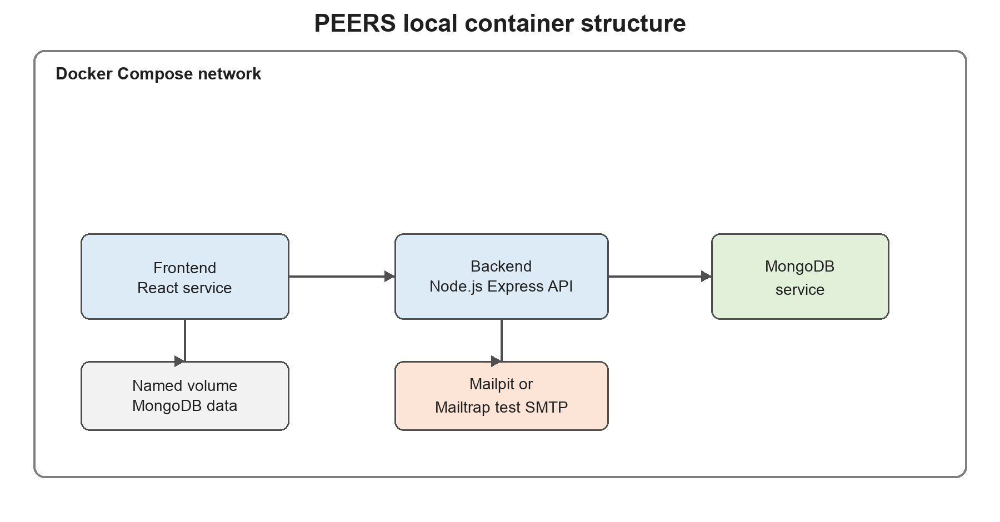

## Target Container Design

Each supported machine must run the same PEERS components. The architecture review, Target Architecture section, names a React frontend, Node.js Express backend, MongoDB service, and email test service as the planned local environment. Docker Compose should place these services on one internal network and expose only the ports needed by a developer browser or test runner. The diagram shows how that structure supports the remaining configuration rules.

Figure 1. Proposed local container arrangement for PEERS.

The frontend needs to present the existing user interface from a service that is separate from the API. The PEERS architecture review identifies React as the frontend tier that calls the backend REST API. The frontend configuration should use an API base URL that points to the backend service or approved local host route rather than a hard coded staging address. That separation allows the backend service to use its own image and dependency plan.

The backend must preserve the modular monolith while using external configuration. The architecture review describes authentication, courses, rosters, teams, evaluations, reporting, and professor settings as modules inside one backend process. The Dockerfile should install locked dependencies, copy the application source, define a non-secret runtime command, and expose the API port. This service then connects to MongoDB and the email test service through configuration values.

Local test data must survive normal restarts without entering the repository. The project specification lists MongoDB as a suggested technology and asks teams to initialize required services and databases. A MongoDB container backed by a named volume keeps local data between normal restarts, while a documented reset command removes it only when a clean test state is needed. This controlled persistence supports repeatable validation.
