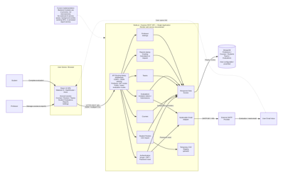

# Current Architecture

[Back to architecture review overview](README.md)

## Current Architecture

PEERS (Peer Evaluation System) is an existing web-based application developed by previous Kennesaw State University capstone teams to support peer-evaluation activities for professors and students. The system supports major workflows including professor authentication, course creation, student roster import, team creation, evaluation management, individualized evaluation links, email invitations and reminders, student evaluation submission, evaluation aggregation, and instructor reporting. The current project builds upon this inherited application rather than replacing it or developing a substantially new product.

The current PEERS application follows a three-tier web architecture. A React single-page application provides the frontend user interface, a Node.js/Express REST API provides the backend application logic, and MongoDB provides persistent data storage through Mongoose. The backend operates as a modular monolith, meaning major responsibilities such as authentication, courses, rosters, teams, evaluations, reporting, and professor settings are logically separated into functional modules while remaining part of a single backend application. PEERS also integrates with an external SMTP provider for evaluation invitations, reminders, and password-reset emails.

This structure provides separation between the user interface, application logic, and stored data while avoiding the additional deployment and networking complexity associated with a distributed microservices architecture. Database access is centralized through the backend rather than allowing the React frontend to communicate directly with MongoDB. Professor authentication uses JWT bearer tokens, while student evaluation access is provided through personalized evaluation-link tokens.

The purpose of this architecture review is to establish a clear baseline of the inherited PEERS architecture before modernization work begins. The current capstone project is focused on improving the application's software-engineering workflow through automated testing, containerization, Continuous Integration, Continuous Delivery, and automated staging deployment while preserving validated existing functionality. The primary objective is not significant new feature development, but the creation of a reliable and repeatable software-delivery process around the existing application.

The architecture diagram above represents the current PEERS system and provides the baseline used throughout this review. The following sections identify architectural issues and constraints, the stakeholders affected by the architecture, relevant software-quality attributes, the architectural goals of the project, and the next steps required to support the planned modernization effort.

## Related Documents

- [Technical Assessment](../technical-assessment/README.md)

# Architecture Issues and Constraints

[Back to architecture review overview](README.md)

## Architecture Review

The inherited PEERS architecture provides a relatively simple three-tier structure and clear separation between the frontend, backend, and database. However, the architecture review identified several issues and constraints that may affect maintainability, reliability, portability, security, and future deployment. The following table summarizes the primary architectural concerns, their potential impact, and their relative priority for the current modernization effort. Detailed implementation plans for containerization, automated testing, and CI/CD are documented in their respective Milestone 1 deliverables.

| Architecture issue | Business impact | Priority | Notes |
| --- | --- | --- | --- |
| Docker configuration does not match the application's database architecture | The existing Docker Compose configuration references PostgreSQL even though PEERS uses MongoDB. This prevents the documented container environment from accurately representing the application and can make setup unreliable for developers. | HIGH | Update the container architecture to use MongoDB and match the actual React, Node.js/Express, and MongoDB application structure. Detailed remediation should be covered in the Containerization Assessment. |
| Complete repeatable container architecture is missing | Developers cannot reliably reproduce the same frontend, backend, and database environments, increasing setup effort and the chance of environment-specific problems. | HIGH | Frontend, backend, MongoDB, configuration, and required supporting services need a documented and repeatable container structure. |
| Environment-specific configuration is partially hard-coded | Hard-coded URLs or environment settings can cause the application to behave differently between local and staging environments and make deployment more difficult to maintain. | HIGH | Environment-dependent settings should be supplied through external configuration rather than embedded directly in application code. |
| Secret and credential handling requires improvement | Improperly stored credentials, tokens, or connection values can expose sensitive configuration and make secure environment separation difficult. | HIGH | Secrets should be removed from committed configuration and supplied through approved environment or secret-storage mechanisms. |
| Backend functionality runs within a single application process | A failure or heavy workload in one backend responsibility can affect the entire PEERS backend because authentication, courses, evaluations, reporting, and other modules share the same Node.js process and database connection. | MEDIUM | The modular monolith remains appropriate for the current project size. The goal is to preserve module boundaries rather than introduce microservices. |
| Email operations occur synchronously during API requests | Email delivery can increase request-processing time and an external SMTP delay or failure can affect the user-facing request being processed. | MEDIUM | The current architecture does not use a background worker or message queue for email operations. This should be documented as a limitation rather than necessarily redesigned within the current project scope. |
| CSV imports rely on temporary local server storage | Local temporary storage can complicate portability and horizontal scaling because uploaded files are tied to the individual backend instance processing the request. | MEDIUM | This is acceptable for the current scale but should be documented as a constraint for future scaling or multi-instance deployment. |
| Backend modules may become increasingly coupled as the application grows | Shared models and application state can make future changes harder to isolate and maintain, increasing the chance that modifications to one area affect another. | MEDIUM | Preserve clear module boundaries between authentication, courses, rosters, teams, evaluations, reporting, and professor settings. |
| Automated validation is limited in the inherited architecture | Changes to application components can introduce regressions without being detected early, reducing confidence that existing professor and student workflows remain functional. | HIGH | This review should identify the architectural concern only. The detailed solution belongs in the Automated Testing Strategy and CI/CD Architecture Design |

## Related Documents

- [Containerization Assessment](../containerization-assessment/README.md)
- [Automated Testing Strategy](../automated-testing-strategy/README.md)
- [CI/CD Architecture Design](../ci-cd-architecture-design/README.md)

# Stakeholders and Software Quality Attributes

[Back to architecture review overview](README.md)

## Stakeholders

| Name | Role |
| --- | --- |
| Dr. Geetika Vyas | Project Sponsor |
| Team P25-02 | Development and Modernization Team |
| University Faculty / Course Instructors | Primary System Users |
| Students | Primary System Users |
| Future Software Developers/Maintainers | Secondary System Users |
| Prof. Yan Huang | Capstone Professor |

## Software Quality Attributes

| Software Quality Attribute | Definition | Key success metrics | Notes |
| --- | --- | --- | --- |
| Maintainability | The application, CI/CD configuration, tests, and documentation should remain clearly organized and understandable so future developers can modify and maintain the system. | Clear module responsibilities; consistent configuration and naming; documented setup and maintenance procedures. | Further addressed in the Technical Assessment Report and final technical documentation. |
| Repeatability | The same source version and configuration should produce consistent build and test results across supported environments. | Builds and automated tests execute consistently; development and staging environments can be reproduced from documented configuration. | Further addressed in the Development Environment Validation, Containerization Assessment, and CI/CD Architecture Design. |
| Reliability | Failures in required validation or deployment checks should be detected, reported, and prevented from progressing through the delivery process. | Failed required checks stop the applicable workflow; failed staging validation is reported; health and smoke tests confirm successful deployment. | Further addressed in the CI/CD Architecture Design and Automated Testing Strategy. |
| Security | Credentials, tokens, connection strings, and other sensitive values should be protected and excluded from committed source code. | No sensitive values committed to the repository; approved secret-storage mechanisms are used; dependency and security checks run automatically. | Further addressed in the Technical Assessment Report and CI/CD Architecture Design. |
| Privacy | Development, testing, and staging environments should avoid exposing real student information or unintentionally contacting real users. | Tests use synthetic, de-identified, or sponsor-approved data; staging email behavior does not contact unintended users. | Further addressed in the Automated Testing Strategy and staging configuration documentation. |
| Traceability | Requirements, tests, defects, code changes, pipeline results, and milestone evidence should be traceable throughout the project. | Validated requirements can be linked to tests and supporting evidence; relevant project artifacts can be traced through documentation and repository history. | Further addressed in the Requirements Traceability Matrix. |
| Portability | The application should operate consistently across supported developer systems, CI runners, and the staging environment. | Containerized services run consistently across supported environments; machine-specific setup is minimized. | Further addressed in the Development Environment Validation and Containerization Assessment. |
| Configurability | Environment-specific values should be supplied through configuration rather than being hard-coded in application source code. | URLs, credentials, connection information, and service settings are externally configurable for local and staging environments. | Further addressed in the Technical Assessment Report and Containerization Assessment. |
| Usability | Setup, testing, deployment, and troubleshooting procedures should be understandable to future developers with appropriate technical experience. | Documentation provides clear procedures for setup, testing, deployment, and troubleshooting without requiring undocumented knowledge. | Further addressed in the final Technical Documentation, including setup, configuration, testing, deployment, release, and troubleshooting procedures. |
| Functional Preservation | Architectural and delivery-process changes should preserve validated PEERS functionality. | Existing critical workflows continue to pass regression and end-to-end testing after project changes. | Further addressed in the Requirements Validation, Critical Workflow Identification, and Automated Testing Strategy. |

## Related Documents

- [Requirements Traceability Matrix](../requirements-traceability-matrix/README.md)
