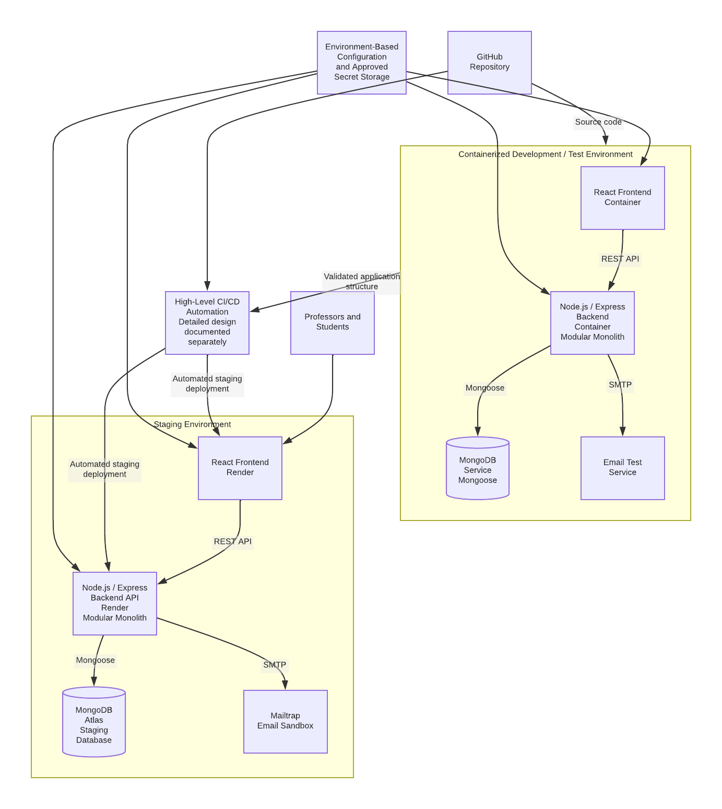

# Target Architecture

[Back to architecture review overview](README.md)

## Target Architecture

The planned PEERS architecture preserves the application's existing three-tier structure while adding the infrastructure needed to support a more reliable and repeatable software delivery process. The core application will continue to use a React frontend, a Node.js/Express backend implemented as a modular monolith, and MongoDB with Mongoose for persistent data access. This approach allows the team to modernize the development and deployment environment without replacing the existing technology stack or unnecessarily restructuring the application's major functional modules. The project specification likewise emphasizes preserving the inherited application while improving its software engineering and delivery practices rather than developing a replacement system.

As shown in the target architecture diagram, the project introduces a containerized development and test environment containing the React frontend, Node.js/Express backend, MongoDB service, and an email test service. The frontend communicates with the backend through the application's REST API, while the backend continues to access MongoDB through Mongoose and communicates with Mailtrap through SMTP. Containerization is intended to provide a more repeatable environment for development and testing and reduce differences between developer systems.

The architecture also introduces a separate staging environment for validating approved application changes before project completion. Under the proposed architecture, the React frontend and Node.js/Express backend will be hosted in the staging environment using Render, while MongoDB Atlas will provide the staging database. Email generated during staging activities will be directed to Mailtrap, preventing test messages from being unintentionally delivered to real users. The staging environment is intentionally separated from local development and testing so that configuration, data, credentials, and email behavior can be managed independently.

At a high level, the diagram also shows the relationship between the GitHub repository, automated CI/CD processes, and the staging environment. Source code maintained in GitHub will pass through automated validation before approved changes are deployed to staging. This architecture review shows that relationship only to demonstrate how the delivery process connects to the application architecture; detailed pipeline triggers, quality gates, testing stages, branch protections, and deployment procedures are documented separately in the CI/CD Architecture Design and other related deliverables.

## Related Documents

- [Containerization Assessment](../containerization-assessment.md)
- [CI/CD Architecture Design](../ci-cd-architecture-design.md)
